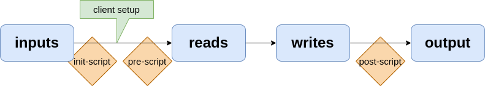

# Configure applications and their relationship from kubernetes


[](./LICENSE)
[](https://github.com/sebt3/kuberest/actions/workflows/ci.yml)
[](
https://hub.docker.com/r/sebt3/kuberest/tags/)


This repository contains a custom Kubernetes controller that can create/update/delete REST object on RESTfull api-endpoint.
The main goal is to not write a post-install Job filled with curl commands ever again for my applications deployments on Kubernetes. Inspirations come from the excellent [restapi terraform provider](https://registry.terraform.io/providers/Mastercard/restapi/latest/docs) and [Tekton](https://tekton.dev/docs/pipelines/).

## Use cases

- Configure OpenID applications in most ID-provider to provide seamless integration between applications
- Configure your own forge projects
- Configure any application that provide REST endpoints (that's a lot of them)

## Installation

(TL;DR: `kubectl apply -k github.com/sebt3/kuberest//deploy`)

Since this is a kubernetes operator, the installations steps are:
- first the CustomResourceDefinition
- then the operator controlling the ressources

Feel free to pick any of the installtions options for both.

### CRD


#### kubectl

```sh
kubectl apply -f deploy/crd/crd.yaml
```
#### kustomize

```sh
kubectl apply -k github.com/sebt3/kuberest//deploy/crd
```

### Operator

#### kubectl

```sh
helm template charts/kuberest | kubectl apply -f -
kubectl wait --for=condition=available deploy/kuberest --timeout=30s
```

#### kustomize

```sh
kubectl create ns kuberest
kubectl apply -k github.com/sebt3/kuberest//deploy/operator
kubectl wait -n kuberest --for=condition=available deploy/kuberest --timeout=30s
```

#### helm

```sh
helm repo add kuberest https://sebt3.github.io/kuberest/
kubectl create ns kuberest
helm install kuberest/kuberest kuberest --namespace kuberest
kubectl wait -n kuberest --for=condition=available deploy/kuberest --timeout=30s
```


### Tenant aware

The controller can either function per-namespace (refuse to read secrets from other namespace mostly) or behave globally. The default behaviour is to limit to current namespace, to activate, set the environement variable MULTI_TENANT to false (or tenants.enabled=false for the chart)

## Usage

### basic structure of a RestEndpoint object

### Running flow




### Examples

### Abuses

Doing like in the following is not realy recommanded, there's probably